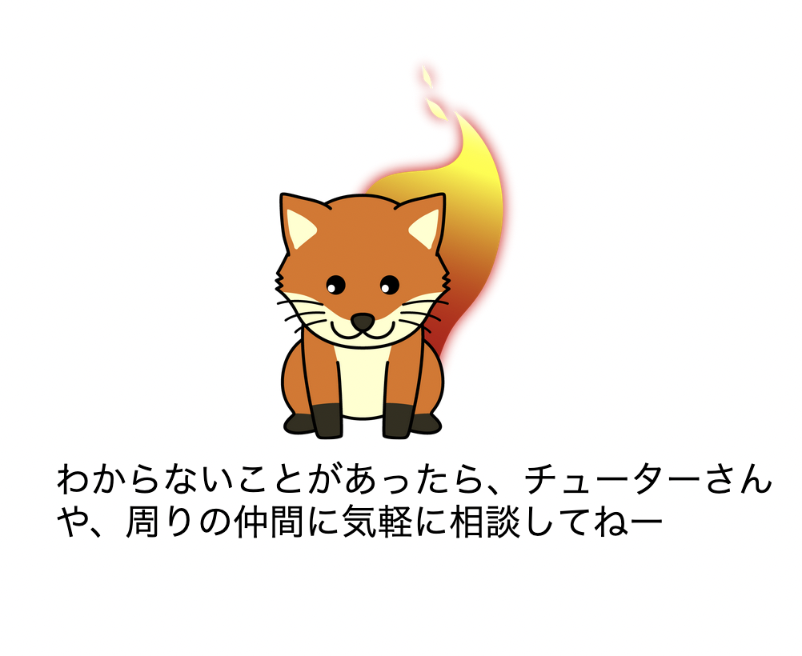

# 3-5.翻訳開始! - 参考リンク集

### 翻訳時の用語や表記の仕方、文体などに関して参照してください。

### 【MDN 翻訳を始めよう】

- [MDN Web Docs ドキュメント翻訳の始め方](https://github.com/mozilla-japan/translation/wiki/Get-started-with-translation-of-Mozilla-documentations)
- [表記ガイドライン](https://github.com/mozilla-japan/translation/wiki/Editorial-Guideline)
- [L10N ガイドライン](https://github.com/mozilla-japan/translation/wiki/L10N-Guideline)
- [Mozilla 用語集](https://github.com/mozilla-japan/translation/wiki/Mozilla-L10N-Glossary)
- [日本語の文体](https://docs.google.com/spreadsheets/d/1y-hC-xMXawCgcYZwJDnvuSlAOTgMRLLyqXurpYkJbYE/edit#gid=0)

