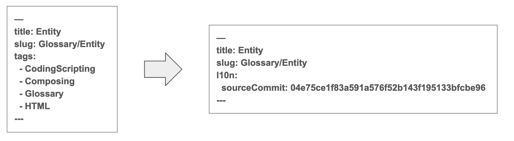

# 4-3.新規翻訳の手順（index.md の作成）


1. 好きなエディタで、tramslated-content リポジトリの対象の index.md ファイルを開きます。
  ```
  [translated-content] $ open files/ja/glossary/entity/index.md
  ```
1. メタデータ部分（Front-Matter）を編集して、不要なメタデータを削除します。
  
  - 上記は ja - フロントマターから不要なメタデータを削除 の要請による作業です。
  - "title", "slug" 以外のメタデータを削除し、"l10n: sourceCommit" を追加します。
  - sourceCommit には、参考にしている content リポジトリの英語版 index.md の最新コミットIDを記述します。
    ```
    [content] $ git log files/en-us/glossary/entity/index.md
    ```
1. この作業を行った上で、本文を翻訳します。
  - 実際の参考PR： https://github.com/mdn/translated-content/pull/8025
